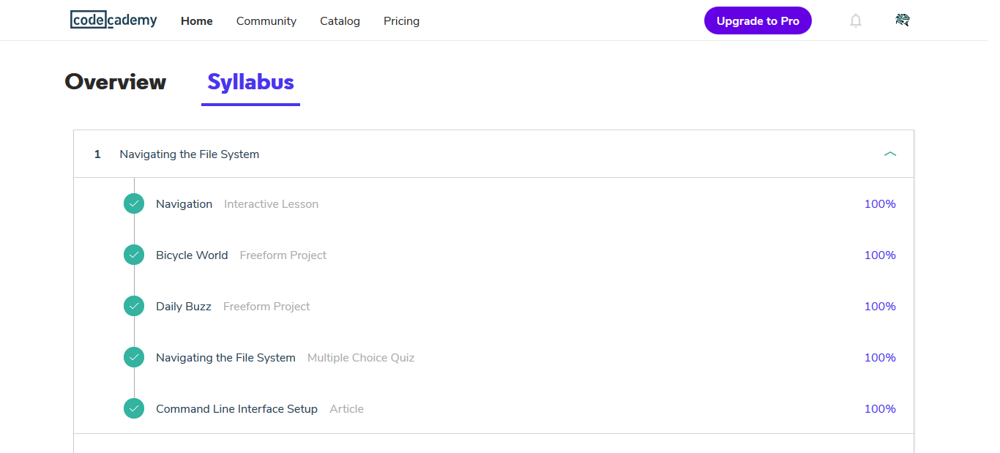
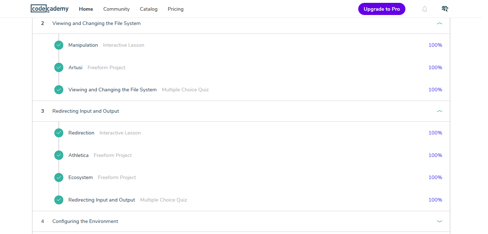
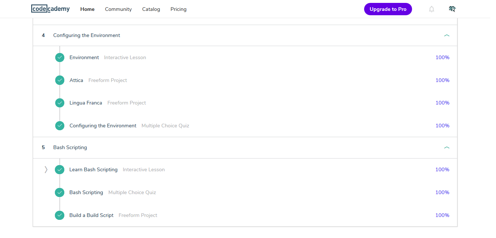

## Linux CLI, and HTTP

  Good sources for studing. 
  
  I updated my knowledge about HTTP. 
  
  I mentioned the most simple linux commands and acted on loops and conditions.
  
	
  
  
  
  
  
  

[back](../README.md)
